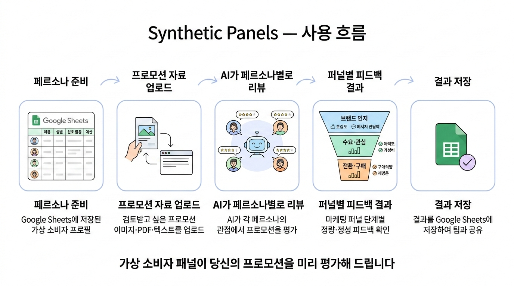
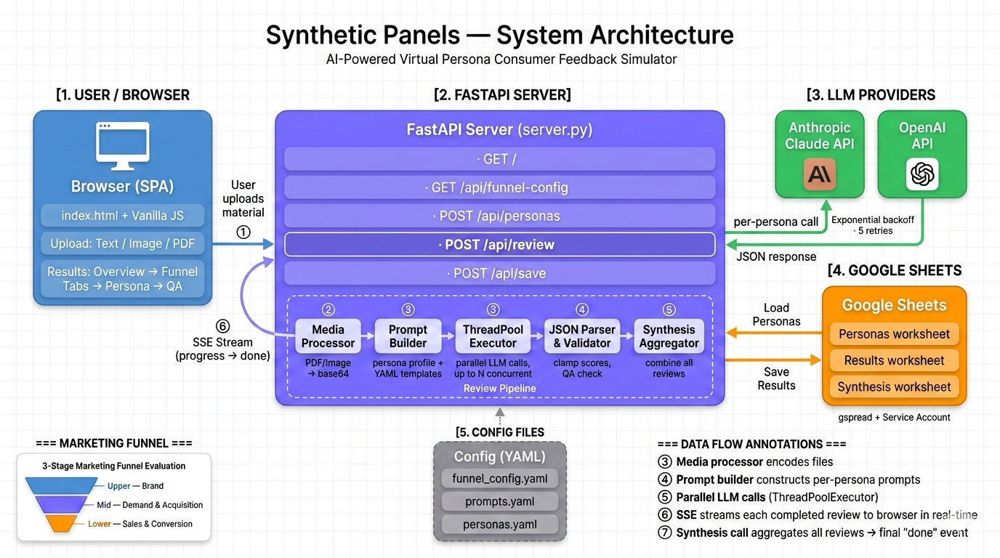
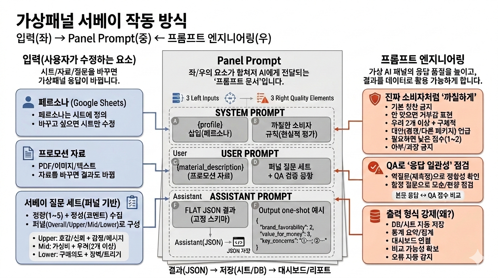

# Synthetic Panels

가상 페르소나를 활용하여 프로모션 자료에 대한 소비자 반응을 시뮬레이션하는 웹 애플리케이션입니다.
브랜드 인지부터 전환까지, 마케팅 퍼널 전 단계의 정량·정성 피드백을 빠르게 확인할 수 있습니다.

## 주요 기능

- **마케팅 퍼널 기반 평가** — Upper(브랜드) → Mid(수요 창출) → Lower(전환) 3단계 퍼널 구조
- **팀 모드 지원** — `marketing` / `commerce` 두 가지 팀 프로필 및 설정 독립 운영
- **멀티 LLM 지원** — Claude(Anthropic) 및 OpenAI 중 선택 가능; 리뷰·요약·종합 모델 개별 지정
- **다양한 입력 형식** — 텍스트, 이미지, PDF 업로드 지원
- **병렬 페르소나 리뷰** — 최대 N명의 가상 패널이 동시에 평가 (패널 크기 및 샘플링 시드 지정 가능)
- **QA 품질 관리** — `off` / `lite` / `full` 모드로 응답 일관성 및 트랩 통과율 검증
- **서베이 방식 지원** — YAML 기반 서베이 질문 템플릿으로 구조화된 설문 수집
- **통합 분석** — 개별 리뷰 완료 후 자동으로 종합 분석(Synthesis) 생성
- **실시간 진행 표시** — SSE(Server-Sent Events) 기반 스트리밍
- **PDF 내보내기** — 결과 리포트 PDF 저장
- **일일 리뷰 제한** — 하루 리뷰 횟수 제한 및 비밀번호 보호 기능
- **Google Sheets 연동** — 페르소나 로드 및 결과 저장

## 퍼널 구조

| 단계 | 대상 | 목적 | 주요 지표 |
|------|------|------|-----------|
| **Brand** (Upper) | 잠재 고객 | 브랜드 인지 및 태도·이미지 형성 | 호감도, 메시지 전달력, 감정 반응 |
| **Demand & Acquisition** (Mid) | 관심을 보인 잠재·신규 고객 | 수요 확보 및 신규 고객 획득 | 매력도, 가성비, 경쟁 비교, 추천 의향 |
| **Sales & Conversion** (Lower) | 구매를 고려 중인 고객 | 최종 전환과 매출 | 구매 확률, 전환 장벽, 가격 민감도 |

## 시작하기

### 사전 요구사항

- Python 3.12+
- Anthropic API Key 또는 OpenAI API Key
- Google Service Account JSON (Sheets 연동 시)

### 설치

```bash
git clone <repository-url>
cd synthetic-panels

python -m venv .venv
source .venv/bin/activate
pip install -r requirements.txt
```

### 환경 변수

프로젝트 루트에 `.env` 파일을 생성합니다.

```env
ANTHROPIC_API_KEY=sk-ant-...
OPENAI_API_KEY=sk-...
GOOGLE_SERVICE_ACCOUNT_JSON=/path/to/service-account.json
SHEETS_URL=https://docs.google.com/spreadsheets/d/...
WORKSHEET_NAME=personas
MAX_CONCURRENT_CALLS=5
QA_MODE=lite
REVIEW_PASSWORD=
DAILY_REVIEW_LIMIT=3
```

| 변수 | 필수 | 기본값 | 설명 |
|------|------|--------|------|
| `ANTHROPIC_API_KEY` | LLM 선택 시 | — | Anthropic API 키 |
| `OPENAI_API_KEY` | LLM 선택 시 | — | OpenAI API 키 |
| `GOOGLE_SERVICE_ACCOUNT_JSON` | Sheets 사용 시 | — | 서비스 계정 JSON 파일 경로 |
| `SHEETS_URL` | Sheets 사용 시 | — | 대상 Google Sheet URL |
| `WORKSHEET_NAME` | 선택 | `personas` | 페르소나 워크시트 이름 |
| `MAX_CONCURRENT_CALLS` | 선택 | `5` | 최대 동시 LLM 호출 수 |
| `QA_MODE` | 선택 | `lite` | QA 모드 (`off` / `lite` / `full`) |
| `REVIEW_PASSWORD` | 선택 | — | 일일 한도 초과 시 요구할 비밀번호 |
| `DAILY_REVIEW_LIMIT` | 선택 | `3` | 하루 최대 리뷰 실행 횟수 |

### 실행

```bash
source .venv/bin/activate
uvicorn server:app --reload --port 8000
```

브라우저에서 http://127.0.0.1:8000 접속

## 사용 흐름



1. **페르소나 로드** — Google Sheets에서 패널 목록을 불러옵니다 (패널 크기·샘플링 시드 지정 가능)
2. **자료 업로드** — 프로모션 텍스트, 이미지, PDF를 입력합니다
3. **설정 선택** — LLM 프로바이더, 모델, QA 모드, 팀(team)을 선택합니다
4. **리뷰 실행** — 패널별 병렬 평가가 진행되며 실시간으로 결과가 표시됩니다
5. **결과 확인** — 개요, 퍼널별 상세, 개별 리뷰, QA 탭에서 결과를 확인합니다
6. **저장 / 내보내기** — Google Sheets에 결과를 저장하거나 PDF로 내보냅니다

## 시스템 아키텍처



## 패널 프롬프트 구조



## 프로젝트 구조

```
synthetic-panels/
├── server.py                  # FastAPI 앱 진입점
├── requirements.txt           # Python 의존성
├── render.yaml                # Render 배포 설정
├── app/
│   ├── api/                   # API 라우터 (FastAPI APIRouter)
│   │   ├── personas.py        # GET /api/funnel-config, /api/survey-template, /api/review-limit, POST /api/personas
│   │   ├── review.py          # POST /api/review (SSE 스트리밍)
│   │   └── save.py            # POST /api/save
│   ├── core/                  # 환경변수 로드 및 설정 로더
│   │   ├── __init__.py        # 환경변수 정의
│   │   ├── funnel.py          # 퍼널 필드 헬퍼 (캐시 적용)
│   │   └── survey.py          # 서베이 템플릿 로더
│   ├── llm/                   # LLM 통합
│   │   ├── claude.py          # Anthropic Claude API
│   │   ├── openai_client.py   # OpenAI API
│   │   ├── prompt.py          # 프롬프트 빌더
│   │   ├── parse.py           # JSON 파싱 유틸리티
│   │   └── retry.py           # 공유 재시도/백오프 엔진
│   ├── media/
│   │   └── processor.py       # PDF/이미지 → base64 인코딩
│   ├── models/                # 데이터 모델
│   │   ├── persona.py         # Persona 데이터클래스
│   │   ├── persona_summary.py # PersonaSummary 데이터클래스
│   │   ├── review.py          # Review 데이터클래스
│   │   └── qa.py              # QA 스코어링
│   ├── services/              # 비즈니스 로직 레이어
│   │   ├── review_pipeline.py # 리뷰 실행 파이프라인 (ThreadPoolExecutor)
│   │   ├── review_serializer.py # 리뷰 직렬화/역직렬화
│   │   └── usage.py           # 일일 리뷰 횟수 추적
│   └── sheets/
│       ├── client.py          # Google Sheets 연결
│       ├── personas.py        # 페르소나 로드 및 샘플링
│       └── results.py         # 결과 저장
├── config/                    # YAML 설정 파일 (Python 없음)
│   ├── funnel_config.yaml                    # marketing 퍼널 필드 정의
│   ├── survey_questions.yaml                 # marketing 서베이 질문
│   ├── synthetic_panels_prompts.yaml         # marketing 리뷰 프롬프트
│   ├── synthesis_analysis_prompts.yaml       # marketing 종합 분석 프롬프트
│   ├── personas.yaml                         # 페르소나 프로필 템플릿
│   ├── commerce_funnel_config.yaml           # commerce 퍼널 필드 정의
│   ├── commerce_survey_questions.yaml        # commerce 서베이 질문
│   ├── commerce_synthetic_panels_prompts.yaml # commerce 리뷰 프롬프트
│   ├── commerce_synthesis_analysis_prompts.yaml # commerce 종합 분석 프롬프트
│   └── commerce_personas.yaml               # commerce 페르소나 템플릿
└── static/
    ├── index.html             # 메인 HTML
    ├── app.css                # 스타일시트
    └── js/
        ├── main.js            # JS 진입점
        ├── api.js             # API 호출
        ├── state.js           # 상태 관리
        ├── ui.js              # UI 유틸리티
        ├── tabs-controller.js # 탭 컨트롤러
        ├── themes.js          # 테마 관리
        ├── review-runner.js   # 리뷰 실행 제어
        ├── persona-loader.js  # 페르소나 로드 제어
        ├── pdf-exporter.js    # PDF 내보내기
        ├── usage-badge.js     # 일일 사용량 뱃지
        ├── demo.js            # 데모 모드 진입점
        ├── demo/
        │   └── index.js       # 데모 데이터
        └── render/            # 결과 렌더링 모듈
            ├── helpers.js
            ├── overview.js
            ├── funnel-tab.js
            ├── individual.js  # 개별 리뷰 탭
            ├── panel-stats.js # 패널 통계
            ├── qa.js          # QA 탭
            ├── survey.js      # 서베이 결과 탭
            └── survey-schema.js # 서베이 스키마 헬퍼
```

## API 엔드포인트

| 메서드 | 경로 | 설명 |
|--------|------|------|
| `GET` | `/` | 메인 페이지 (SPA) |
| `GET` | `/api/funnel-config?team=` | 팀별 퍼널 구조 반환 |
| `GET` | `/api/survey-template?team=` | 팀별 서베이 질문 템플릿 반환 |
| `GET` | `/api/review-limit` | 오늘 리뷰 횟수 및 한도 반환 |
| `POST` | `/api/personas` | Google Sheets에서 페르소나 로드 |
| `POST` | `/api/review` | 리뷰 실행 (SSE 스트리밍) |
| `POST` | `/api/save` | 결과를 Google Sheets에 저장 |

## 배포

[Render](https://render.com) 배포용 `render.yaml`이 포함되어 있습니다.

```yaml
services:
  - type: web
    name: synthetic-panels
    env: python
    buildCommand: pip install -r requirements.txt
    startCommand: uvicorn server:app --host 0.0.0.0 --port $PORT
```

Render 대시보드에서 환경 변수를 설정한 후 배포합니다.

## 기술 스택

- **Backend**: FastAPI, Uvicorn, SSE-Starlette
- **Frontend**: Vanilla JS (모듈 기반), CSS Custom Properties
- **LLM**: Anthropic Claude API, OpenAI API
- **데이터**: Google Sheets (gspread), YAML 설정
- **미디어**: pdf2image, Pillow
